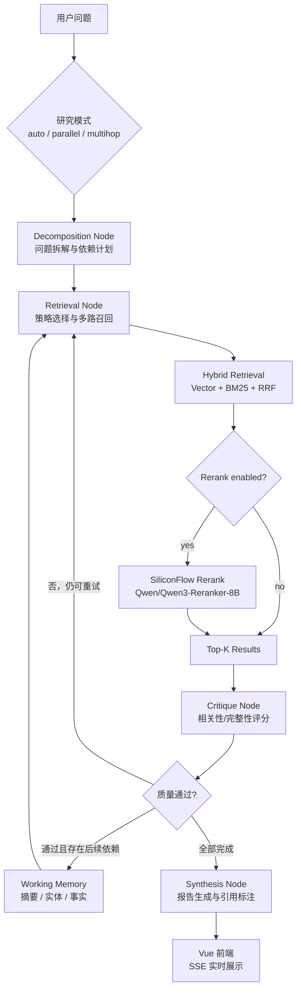

<div align="center">

# Deep Research Agent

**一个面向复杂问题的 Agentic RAG 深度研究系统**

让 Agent 自主完成问题拆解、任务级研究模式选择、混合召回、Rerank 精排、质量评估、
多跳上下文传递、查询改写与带引用报告生成。

<p>
  
  
  
  
  
</p>

<p>
  <a href="#核心能力">核心能力</a> ·
  <a href="#系统架构">系统架构</a> ·
  <a href="#深度研究模式">研究模式</a> ·
  <a href="#快速开始">快速开始</a> ·
  <a href="#配置说明">配置说明</a> ·
  <a href="#开放许可测试语料">测试语料</a> ·
  <a href="#api-概览">API 概览</a> ·
  <a href="#测试与验证">测试与验证</a>
</p>

</div>

---

## 项目简介

传统 RAG 往往是一次性链路：用户提问 → 检索 → 回答。它不会主动判断检索结果是否足够好，也不会在信息不足时自动调整搜索方向。

`Deep Research Agent` 将 RAG 升级为一个可观测、可重试、可扩展的研究型 Agent：

```text
用户问题
  -> Query Decomposition：拆解为 2-5 个研究步骤与依赖关系
  -> Strategy Routing：为每个子问题选择 semantic / keyword / hybrid
  -> Hybrid Retrieval：向量检索 + BM25 + RRF 粗排
  -> Optional Rerank：SiliconFlow Qwen Reranker 二阶段精排
  -> Quality Critique：相关性 + 完整性双维度评估
  -> Self Correction：失败时查询改写与策略升级重试
  -> Multi-hop Context：提取实体/事实并驱动下一跳查询
  -> Synthesis：聚合多源信息并生成带引用的研究报告
```

---

## 核心能力

| 能力 | 说明 |
|---|---|
| 自主问题拆解 | 使用 LLM 将复杂问题拆成并列或相互依赖的研究步骤 |
| 自适应检索策略 | 根据问题类型选择 `semantic`、`keyword` 或 `hybrid` |
| 中文关键词检索 | `BM25 + jieba` 中文词级分词，提升中文精确匹配效果 |
| 混合检索 | 向量召回 + BM25 召回 + RRF 融合排序 |
| 二阶段精排 | 可选接入 SiliconFlow `Qwen/Qwen3-Reranker-8B` |
| 质量 Critique | 对检索结果进行相关性与完整性评分 |
| 自我纠错 | 低质量结果会触发查询改写和策略升级，最多重试 3 次 |
| 任务级研究模式 | 支持 `auto`、`parallel`、`multihop`，每次任务独立选择执行方式 |
| 多跳推理 | 基于 `depends_on`、实体、事实和 working memory 驱动后续检索 |
| 流式可视化 | FastAPI SSE 实时推送 Agent 执行过程到 Vue 前端 |
| 文档管理 | 支持 PDF、DOCX、Markdown、TXT 上传、切块、嵌入和索引 |
| 上传安全 | 单文件默认最大 `20 MB`，上传文件名会做安全清理 |
| 可追溯来源 | 报告使用稳定来源 ID，Chroma 与 Milvus 均保留文件元数据 |
| 研究型前端 | 响应式布局、研究路径状态、报告目录、复制和 Markdown 导出 |

---

## 系统架构



### Agent 状态流转

```text
Decomposition -> Retrieval -> Critique -> should_retry?
                                         | 
                                         |-- retry -> Retrieval
                                         |-- done  -> Synthesis -> END
```

当研究计划包含依赖步骤时，Critique 通过后会提取来源支撑的摘要、实体和事实，
作为下一跳检索的 working memory。当前版本使用内存结构化上下文，知识图谱持久化仍属于后续阶段。

---

## 技术栈

| 层级 | 技术 | 说明 |
|---|---|---|
| Agent 编排 | `LangGraph` | 显式状态流转与条件路由 |
| 后端服务 | `FastAPI` + `SSE` | 异步 API 与流式进度推送 |
| 前端界面 | `Vue 3` + `Vite` + `Naive UI` | 多页面交互式前端 |
| LLM | SiliconFlow / Qwen / OpenAI-compatible | 多 Provider 统一封装 |
| Embedding | `BAAI/bge-large-zh-v1.5` | 1024 维，支持本地/API 双模式 |
| 向量库 | Chroma / Milvus / Zilliz Cloud | 本地持久化或远程向量库 |
| 关键词检索 | `rank-bm25` + `jieba` | 中文词级分词 + BM25 |
| 混合排序 | RRF | 融合向量检索与 BM25 排名 |
| Rerank | SiliconFlow Rerank | 可选 `Qwen/Qwen3-Reranker-8B` 二阶段精排 |
| 配置管理 | `pydantic-settings` + `.env` | 类型安全环境变量配置 |

---

## 功能模块

| 页面 | 路径 | 功能 |
|---|---|---|
| 深度研究 | `/` | 提交复杂问题，查看 Agent 拆解、检索、评估、合成全过程 |
| 快速检索 | `/quick-search` | 快速 RAG 问答，返回摘要和引用来源 |
| 资料管理 | `/documents` | 上传、查看、删除知识库文档 |
| 系统设置 | `/settings` | 配置 LLM、Embedding、向量库、Rerank、Web Search |

### 深度研究模式

| 模式 | 行为 | 适用问题 |
|---|---|---|
| `auto` | Planner 自动判断步骤应并列执行还是建立依赖 | 通用研究问题，推荐默认使用 |
| `parallel` | 清除步骤依赖，所有子问题在第 1 跳独立研究 | 对比、盘点、多角度汇总 |
| `multihop` | 强制建立依赖链，将前序实体与事实传给下一跳 | 因果链、实体追踪、桥接型问题 |

`auto` 和 `multihop` 可为单次任务设置 `max_hops`，范围为 `1`～`8`。研究页面会实时展示
Hop、依赖步骤、当前状态、多跳上下文和低置信度提示。

---

## 快速开始

### 1. 环境要求

- Python `3.12+`
- Node.js `18+` 推荐
- SiliconFlow API Key，或其他 OpenAI-compatible API Key

### 2. 安装依赖

```bash
pip install -e ".[dev]"
```

前端依赖会在 `./start.sh` 首次启动时自动安装，也可以手动安装：

```bash
cd frontend-vue
npm install
```

### 3. 配置环境变量

```bash
cp config/.env.example config/.env
vim config/.env
```

最小配置示例：

```env
LLM_PROVIDER=siliconflow
LLM_MODEL=Qwen/Qwen3-8B
LLM_API_KEY=sk-your-siliconflow-api-key-here
LLM_BASE_URL=https://api.siliconflow.cn/v1

EMBEDDING_MODE=api
EMBEDDING_MODEL=BAAI/bge-large-zh-v1.5
EMBEDDING_API_BASE_URL=https://api.siliconflow.cn/v1
EMBEDDING_API_KEY=sk-your-siliconflow-api-key-here
```

### 4. 启动项目

一键启动：

```bash
./start.sh
```

手动启动：

```bash
# 终端 1：后端
uvicorn backend.main:app --reload --port 8000

# 终端 2：前端
cd frontend-vue && npm run dev
```

访问地址：

| 服务 | 地址 |
|---|---|
| 前端 | `http://localhost:5173` |
| 后端健康检查 | `http://localhost:8000/health` |
| Swagger API 文档 | `http://localhost:8000/docs` |

### 使用本地代理，可选

如果 SiliconFlow、GitHub Raw 等外部服务需要通过本机代理访问，请在启动项目前设置：

```bash
export https_proxy=http://127.0.0.1:7890
export http_proxy=http://127.0.0.1:7890
export all_proxy=socks5://127.0.0.1:7890
export no_proxy=127.0.0.1,localhost

./start.sh
```

`start.sh` 启动的后端会继承这些变量，并自动将当前配置的 Milvus/Zilliz 主机加入 `no_proxy`，
避免 gRPC TLS 握手被错误发送到 HTTP/SOCKS 代理。重新打开终端后需要再次设置代理，或将其加入自己的 Shell 配置。

---

## 配置说明

### LangSmith，可选

开启后可在 LangSmith 查看 LangGraph 节点、LLM、Embedding、Rerank 和 Web Search trace。

```env
LANGSMITH_TRACING=true
LANGSMITH_TRACING_V2=true
LANGSMITH_API_KEY=lsv2-your-langsmith-api-key
LANGSMITH_PROJECT=deep-research-agent
LANGSMITH_ENDPOINT=https://api.smith.langchain.com
# 兼容旧版 LangChain/LangSmith tracing 开关
LANGCHAIN_TRACING_V2=true
LANGCHAIN_ENDPOINT=https://api.smith.langchain.com
```

### LLM

```env
LLM_PROVIDER=siliconflow
LLM_MODEL=Qwen/Qwen3-8B
LLM_API_KEY=sk-your-siliconflow-api-key-here
LLM_BASE_URL=https://api.siliconflow.cn/v1
LLM_TEMPERATURE=0.3
LLM_MAX_TOKENS=4096
```

### Embedding

```env
EMBEDDING_MODE=api
EMBEDDING_MODEL=BAAI/bge-large-zh-v1.5
EMBEDDING_API_BASE_URL=https://api.siliconflow.cn/v1
EMBEDDING_API_KEY=sk-your-siliconflow-api-key-here
```

### Rerank，可选

默认关闭，避免额外 API 费用。开启后会先召回候选结果，再调用 SiliconFlow Rerank 精排。

```env
RERANK_ENABLED=false
RERANK_PROVIDER=siliconflow
RERANK_MODEL=Qwen/Qwen3-Reranker-8B
RERANK_API_KEY=
RERANK_BASE_URL=https://api.siliconflow.cn/v1
RERANK_TOP_N=5
RERANK_CANDIDATE_MULTIPLIER=4
RERANK_TIMEOUT=30
```

说明：`RERANK_API_KEY` 留空时，会优先复用 `LLM_API_KEY`，其次复用 `EMBEDDING_API_KEY`。

### 向量库

默认使用本地 Chroma：

```env
RETRIEVAL_VECTOR_BACKEND=chroma
CHROMA_PERSIST_DIR=./data/chroma_db
```

使用 Milvus / Zilliz Cloud：

```env
RETRIEVAL_VECTOR_BACKEND=milvus
MILVUS_URI=https://your-zilliz-endpoint
MILVUS_TOKEN=your-zilliz-token
MILVUS_COLLECTION_NAME=research_docs
```

### Web Search，可选

```env
MCP_WEB_SEARCH_ENABLED=false
MCP_TAVILY_API_KEY=
MCP_TAVILY_MAX_RESULTS=5
MCP_WEB_SEARCH_TIMEOUT=30
```

### Multi-hop Reasoning，可选

```env
REASONING_ENABLED=true
REASONING_MAX_HOPS=3
REASONING_CONTEXT_MAX_CHARS=3000
REASONING_SEARCH_QUERY_MAX_CHARS=400
EMBEDDING_QUERY_MAX_CHARS=500
```

任务选择 `multihop` 时会强制启用多跳上下文，选择 `parallel` 时会关闭步骤依赖；`auto` 模式则遵循
`REASONING_ENABLED` 并由 Planner 决定是否建立依赖。

---

## 文档管理与上传安全

支持上传：

- `.pdf`
- `.docx`
- `.md`
- `.txt`

上传后会自动完成：

```text
保存文件 -> 文本解析 -> 分块 -> Embedding -> 写入向量库 -> 更新 BM25 索引
```

安全策略：

| 项目 | 说明 |
|---|---|
| 大小限制 | 单文件默认最大 `20 MB` |
| 安全文件名 | 清理路径分隔符、控制字符和异常符号 |
| 格式限制 | 仅允许 PDF、DOCX、Markdown、TXT |
| 失败清理 | 上传或索引失败时清理临时文件目录 |

### 开放许可测试语料

项目提供可重复运行的下载脚本，用于准备一套适合快速检索和多跳推理的开放许可资料：

```bash
# 如需代理，先设置上一节中的 proxy 环境变量
python3 scripts/download_open_source_corpus.py

# 将下载内容写入当前配置的 Chroma 或 Milvus 知识库
python3 scripts/index_documents.py data/open_source_docs
```

资料默认保存在 `data/open_source_docs/`，`SOURCE_MANIFEST.md` 记录上游链接、许可证和建议测试问题。

| 资料 | 许可证 | 适合测试 |
|---|---|---|
| Microsoft GraphRAG | MIT | 图结构 RAG、社区摘要、全局检索 |
| LangGraph | MIT | 有状态 Agent、持久化和工作流编排 |
| Haystack | Apache-2.0 | Pipeline、Agent 与检索组件 |
| LlamaIndex | MIT | 私有数据接入、索引和查询接口 |
| Chroma | Apache-2.0 | AI 原生向量存储 |
| Qdrant | Apache-2.0 | 过滤、混合查询和分布式向量检索 |
| HotpotQA | CC BY-SA 4.0 / Apache-2.0 | Supporting facts 与多跳问答评估 |

建议先关闭联网搜索，以确认回答来自本地知识库。例如：

```text
GraphRAG、LangGraph、Haystack 和 LlamaIndex 在一套深度研究系统中可以分别承担什么职责？
```

选择 `multihop` 并将最大跳数设为 `4`，可以观察依赖链和 working memory 的传递过程。

---

## API 概览

### Research API

| 方法 | 路径 | 说明 |
|---|---|---|
| `POST` | `/api/v1/research` | 提交深度研究任务 |
| `GET` | `/api/v1/research/{task_id}/stream` | SSE 订阅研究过程 |
| `GET` | `/api/v1/research/{task_id}` | 查询任务状态与结果 |
| `POST` | `/api/v1/research/{task_id}/cancel` | 取消运行中的任务 |

提交任务示例：

```bash
curl -X POST http://localhost:8000/api/v1/research \
  -H "Content-Type: application/json" \
  -d '{
    "query":"RAG 技术的演进阶段有哪些？",
    "enable_web_search":false,
    "research_mode":"multihop",
    "max_hops":3
  }'
```

`research_mode` 支持 `auto`（自动规划并列或依赖步骤）、`parallel`（所有步骤独立执行）和
`multihop`（强制建立依赖链并传递工作记忆）。`max_hops` 的取值范围为 `1`～`8`，省略时使用系统配置。

### Quick Search API

| 方法 | 路径 | 说明 |
|---|---|---|
| `POST` | `/api/v1/quick-search` | 快速检索 + LLM 摘要 |

```bash
curl -X POST http://localhost:8000/api/v1/quick-search \
  -H "Content-Type: application/json" \
  -d '{"query":"Transformer 的核心机制是什么？","top_k":5}'
```

### Documents API

| 方法 | 路径 | 说明 |
|---|---|---|
| `GET` | `/api/v1/documents` | 文件列表，包含已索引文档 |
| `POST` | `/api/v1/documents/upload` | 上传文档，默认最大 20MB |
| `DELETE` | `/api/v1/documents/{file_id}` | 删除文档及关联 chunks |

### Settings API

| 方法 | 路径 | 说明 |
|---|---|---|
| `GET` | `/api/v1/settings` | 读取当前配置，API Key 掩码返回 |
| `PATCH` | `/api/v1/settings` | 更新 LLM、Embedding、Retrieval、Rerank、MCP 等配置 |
| `POST` | `/api/v1/settings/test-connection` | 测试 LLM、Embedding、Milvus 连接 |
| `GET` | `/api/v1/settings/system-info` | 查看向量库统计与版本信息 |

---

## 项目结构

```text
deep-research-agent/
├── backend/                         # FastAPI 后端
│   ├── main.py                      # 应用入口、CORS、生命周期
│   ├── routers/                     # API 路由
│   └── services/                    # 任务管理服务
├── config/                          # pydantic-settings 配置
│   ├── settings.py
│   └── .env.example
├── data/                            # 示例文档、开放语料、ChromaDB、上传文件
│   └── open_source_docs/            # 开放许可测试语料与来源清单
├── frontend-vue/                    # Vue 3 前端
│   └── src/
│       ├── api/                     # 后端 API 调用层
│       ├── components/              # UI 组件
│       ├── composables/             # SSE 等组合逻辑
│       ├── pages/                   # 页面
│       └── stores/                  # Pinia 状态
├── mcp_servers/                     # MCP Server 实现
├── research_agent/                  # 核心 Agent 逻辑
│   ├── critique/                    # 质量评估与重试控制
│   ├── llm/                         # 多 Provider LLM 客户端
│   ├── planner/                     # 查询拆解与研究计划
│   ├── reasoning/                   # 多跳 working memory 与上下文提取
│   ├── retrieval/                   # 检索、BM25、Rerank、向量库
│   │   ├── bm25.py                  # BM25 + jieba 中文分词
│   │   ├── hybrid.py                # Vector + BM25 + RRF + Rerank
│   │   ├── reranker.py              # SiliconFlow Rerank 客户端
│   │   ├── service.py               # 共享向量库与 BM25 生命周期
│   │   └── vector_store.py          # Chroma / Milvus 向量库
│   ├── synthesis/                   # 报告生成与引用
│   ├── graph.py                     # LangGraph 编排
│   └── streaming.py                 # SSE 事件总线
├── scripts/                         # 文档索引、开放语料下载等辅助脚本
├── tests/                           # 单元与集成测试
├── pyproject.toml
└── README.md
```

---

## 测试与验证

Python 测试：

```bash
PYTHONDONTWRITEBYTECODE=1 python3 -m pytest tests -q
# 48 passed
```

前端构建：

```bash
cd frontend-vue
npm run build
```

真实接口连通性已验证：

| 接口 | 结果 |
|---|---|
| LLM | 可正常回复 |
| Embedding API | `api` 模式，返回 `1024` 维向量 |
| SiliconFlow Rerank | `Qwen/Qwen3-Reranker-8B` 可正常排序 |
| 开放测试语料 | 7 份文档，生成 290 个检索块 |
| Milvus 来源元数据 | 语义检索结果可返回 `file_name` 等引用字段 |

### 常见问题

#### Embedding API 返回 400

通常表示模型、请求格式或输入长度不符合接口要求。当前实现会将推理搜索查询限制为默认 `400` 字符，
Embedding 查询限制为默认 `500` 字符；如果仍然报错，请在系统设置中重新测试 Embedding 连接并检查模型名。

#### SiliconFlow 返回 429

`429` 表示服务繁忙或触发限流。若响应中包含 `code 50609` 和 `System is too busy now`，通常不是输入长度问题。
建议降低并发、等待后重试，并确保代理环境变量已在启动后端前设置。

#### 下载开放语料超时

下载器调用系统 `curl`，会继承 `http_proxy`、`https_proxy` 和 `all_proxy`。确认代理可用后重新运行脚本即可，
同名文件会被覆盖，不会产生重复的本地文件。已导入知识库的资料不要再次通过上传接口重复导入。

---

## 路线图

| 阶段 | 状态 | 方向 |
|---|---|---|
| V1 | 已完成 | 混合检索、质量评估、查询改写、流式报告 |
| V2 | 已完成 | 任务级研究模式、依赖计划、结构化 working memory、多跳推理 |
| V2.1 | 规划中 | Knowledge Graph 持久化，NetworkX -> Neo4j |
| V3 | 规划中 | 更多 MCP 数据源接入，例如 Notion、GitHub、数据库 |
| V4 | 规划中 | Agent 长期记忆、多轮对话与用户画像 |
| V5 | 规划中 | RAGAS 评估看板 + LangFuse 全链路追踪 |

---

## License

MIT © 2025 Liu Yue

---

<div align="center">

**Built with LangGraph, FastAPI, Vue 3 and Agentic RAG**

</div>
