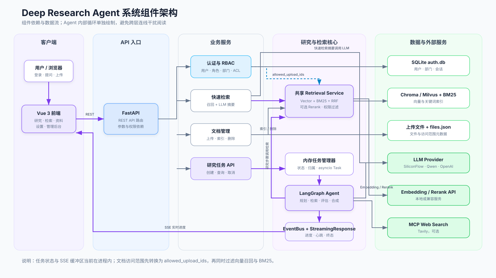
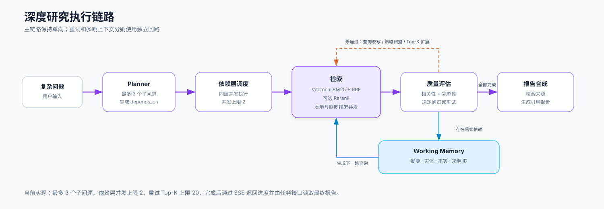

<div align="center">

# Deep Research Agent

**一个面向复杂问题的 Agentic RAG 深度研究系统**

让 Agent 自主完成问题拆解、任务级研究模式选择、混合召回、Rerank 精排、质量评估、
多跳上下文传递、查询改写与带引用报告生成。

<p>
  
  
  
  
  
</p>

<p>
  <a href="#核心能力">核心能力</a> ·
  <a href="#系统架构">系统架构</a> ·
  <a href="#深度研究模式">研究模式</a> ·
  <a href="#快速开始">快速开始</a> ·
  <a href="#配置说明">配置说明</a> ·
  <a href="#开放许可测试语料">测试语料</a> ·
  <a href="#api-概览">API 概览</a> ·
  <a href="#测试与验证">测试与验证</a> ·
  <a href="docs/development.md">开发指南</a> ·
  <a href="docs/troubleshooting.md">故障排查</a>
</p>

</div>

---

## 项目简介

传统 RAG 往往是一次性链路：用户提问 → 检索 → 回答。它不会主动判断检索结果是否足够好，也不会在信息不足时自动调整搜索方向。

`Deep Research Agent` 将 RAG 升级为一个可观测、可重试、可扩展的研究型 Agent：

```text
用户问题
  -> Query Decomposition：拆解为最多 3 个研究步骤与依赖关系（可配置）
  -> Strategy Routing：为每个子问题选择 semantic / keyword / hybrid
  -> Hybrid Retrieval：向量检索 + BM25 + RRF 粗排
  -> Optional Rerank：SiliconFlow Qwen Reranker 二阶段精排
  -> Quality Critique：相关性 + 完整性双维度评估
  -> Self Correction：失败时查询改写与策略升级重试
  -> Multi-hop Context：提取实体/事实并驱动下一跳查询
  -> Synthesis：聚合多源信息并生成带引用的研究报告
```

---

## 文档导航

| 文档 | 适用场景 |
|---|---|
| [快速开始](#快速开始) | 第一次安装、配置并运行项目 |
| [开发指南](docs/development.md) | 理解模块职责、扩展 API/检索/SSE、运行测试 |
| [权限管理](docs/permissions.md) | 配置登录、角色、部门和文档访问范围 |
| [API 文档](docs/api.md) | 查看请求字段、鉴权、SSE 和调用示例 |
| [故障排查](docs/troubleshooting.md) | 处理端口、依赖、代理、Embedding、429 和检索问题 |

---

## 核心能力

| 能力 | 说明 |
|---|---|
| 自主问题拆解 | 使用 LLM 将复杂问题拆成并列或相互依赖的研究步骤 |
| 自适应检索策略 | 根据问题类型选择 `semantic`、`keyword` 或 `hybrid` |
| 中文关键词检索 | `BM25 + jieba` 中文词级分词，提升中文精确匹配效果 |
| 混合检索 | 向量召回 + BM25 召回 + RRF 融合排序 |
| 二阶段精排 | 可选接入 SiliconFlow `Qwen/Qwen3-Reranker-8B` |
| 质量 Critique | 对检索结果进行相关性与完整性评分 |
| 自我纠错 | 低质量结果会触发查询改写和策略升级，最多重试 3 次 |
| 任务级研究模式 | 支持 `auto`、`parallel`、`multihop`，每次任务独立选择执行方式 |
| 多跳推理 | 基于 `depends_on`、实体、事实和 working memory 驱动后续检索 |
| 流式可视化 | FastAPI SSE 实时推送 Agent 执行过程到 Vue 前端 |
| 文档管理 | 支持 PDF、DOCX、Markdown、TXT 上传、切块、嵌入和索引 |
| 登录与 RBAC（第一期） | 本地 SQLite 用户、`admin/researcher/guest` 角色和 Bearer Token |
| 部门级文档权限 | 支持仅自己、单/多部门、工作区、角色、用户和公开七种访问范围 |
| 管理后台 | 用户、部门、角色、文档权限管理，支持按文件名或 ID 搜索 |
| 上传状态反馈 | 上传成功后显示文件名、分块数和索引状态，失败时回滚本次写入 |
| 任务权限 | 研究任务归属和 SSE 订阅均由后端校验，管理员可查看全部任务 |
| 研究状态生命周期 | 报告仅保留在当前页面内存中，刷新页面或切换账号后自动清空，不写入浏览器存储 |
| 上传安全 | 单文件默认最大 `20 MB`，上传文件名会做安全清理 |
| 可追溯来源 | 报告使用稳定来源 ID，Chroma 与 Milvus 均保留文件元数据 |
| 研究型前端 | 响应式布局、研究路径状态、报告目录、复制和 Markdown 导出 |

---

## 系统架构

整体采用“Vue 前端 + FastAPI API + LangGraph Agent + 可替换检索后端”的分层结构。浏览器通过 REST 提交任务和读取结果，通过 SSE 接收实时进度；权限过滤在后端进入检索层之前完成，避免只依赖前端隐藏内容。



图中只表达组件边界、依赖和数据流；深度研究内部的循环与条件路由在下方单独展示。可编辑源文件位于 `docs/assets/system-architecture.mmd` 和 `docs/assets/research-flow.mmd`。

### 要点讲解

| 架构层 | 主要职责 | 关键取舍 |
|---|---|---|
| 前端与 API | 页面交互、任务提交、SSE 进度和管理操作 | REST 负责请求结果，SSE 负责长任务实时反馈 |
| Agent 编排 | 拆解、依赖层并发、多跳上下文、评估、重试和合成 | 使用 LangGraph 显式表达状态和条件路由，便于观测与测试 |
| 检索层 | 向量召回、BM25 精确匹配、RRF 融合和可选 Rerank | 共享检索生命周期，避免每次请求重建索引；权限 ID 在召回阶段过滤 |
| 数据与模型 | 文档、权限、向量库、LLM、Embedding 和 Web Search | Chroma/Milvus、LLM Provider 和 Embedding 可替换 |

这套分层让“快速检索”和“深度研究”复用同一套权限过滤与混合检索能力，同时保持执行复杂度不同：快速检索直接召回并总结，深度研究才启用 Planner、Critique、重试和多跳 working memory。

### 深度研究执行链路



### Agent 状态流转

```text
Decomposition -> Retrieval -> Critique -> should_retry?
                                         | 
                                         |-- retry -> Retrieval
                                         |-- done  -> Synthesis -> END
```

当研究计划包含依赖步骤时，Critique 通过后会提取来源支撑的摘要、实体和事实，
作为下一跳检索的 working memory。当前版本使用内存结构化上下文，知识图谱持久化仍属于后续阶段。

---

## 技术栈

| 层级 | 技术 | 说明 |
|---|---|---|
| Agent 编排 | `LangGraph` | 显式状态流转与条件路由 |
| 后端服务 | `FastAPI` + `SSE` | 异步 API 与流式进度推送 |
| 前端界面 | `Vue 3` + `Vite` + `Naive UI` | 多页面交互式前端 |
| LLM | SiliconFlow / Qwen / OpenAI-compatible | 多 Provider 统一封装 |
| Embedding | `BAAI/bge-large-zh-v1.5` | 1024 维，支持本地/API 双模式 |
| 向量库 | Chroma / Milvus / Zilliz Cloud | 本地持久化或远程向量库 |
| 关键词检索 | `rank-bm25` + `jieba` | 中文词级分词 + BM25 |
| 混合排序 | RRF | 融合向量检索与 BM25 排名 |
| Rerank | SiliconFlow Rerank | 可选 `Qwen/Qwen3-Reranker-8B` 二阶段精排 |
| 配置管理 | `pydantic-settings` + `.env` | 类型安全环境变量配置 |

---

## 功能模块

| 页面 | 路径 | 功能 |
|---|---|---|
| 深度研究 | `/` | 提交复杂问题，查看 Agent 拆解、检索、评估、合成全过程 |
| 快速检索 | `/quick-search` | 快速 RAG 问答，返回摘要和引用来源 |
| 资料管理 | `/documents` | 上传、搜索、查看、删除知识库文档 |
| 系统设置 | `/settings` | 配置 LLM、Embedding、向量库、Rerank、Web Search |
| 管理后台 | `/admin` | 管理用户、部门和角色权限（仅管理员） |
| 登录页面 | `/login` | 权限开启后的统一登录入口 |

管理员登录后可在“管理后台 → 文档权限”搜索文档并逐份设置：仅自己、指定部门、多个部门、工作区、指定角色、指定用户或公开。资料管理页也支持按文件名或文档 ID即时搜索。保存后会同时影响资料列表、快速检索和深度研究的本地检索范围。

### 深度研究模式

| 模式 | 行为 | 适用问题 |
|---|---|---|
| `auto` | Planner 自动判断步骤应并列执行还是建立依赖 | 通用研究问题，推荐默认使用 |
| `parallel` | 清除步骤依赖，所有子问题在第 1 跳独立研究 | 对比、盘点、多角度汇总 |
| `multihop` | 强制建立依赖链，将前序实体与事实传给下一跳 | 因果链、实体追踪、桥接型问题 |

`auto` 和 `multihop` 可为单次任务设置 `max_hops`，范围为 `1`～`8`。研究页面会实时展示
Hop、依赖步骤、当前状态、多跳上下文和低置信度提示。

---

## 快速开始

### 1. 环境要求

- Python `3.12+`
- Node.js `18+` 推荐
- SiliconFlow API Key，或其他 OpenAI-compatible API Key

### 2. 安装依赖

`./start.sh` 会自动创建并使用项目目录下的 `.venv`，同时检查依赖版本与冲突，通常无需手动安装。
示例文档索引也会遵循 `RETRIEVAL_VECTOR_BACKEND`，与后端统一使用 Chroma 或 Milvus，不会写入另一套向量库。

需要手动安装时：

```bash
python3 -m venv .venv
.venv/bin/python -m pip install -e ".[dev]"
```

前端依赖会在 `./start.sh` 首次启动时自动安装，也可以手动安装：

```bash
cd frontend-vue
npm install
```

### 3. 配置环境变量

```bash
cp config/.env.example config/.env
vim config/.env
```

最小配置示例：

```env
LLM_PROVIDER=siliconflow
LLM_MODEL=Qwen/Qwen3-8B
LLM_API_KEY=sk-your-siliconflow-api-key-here
LLM_BASE_URL=https://api.siliconflow.cn/v1

EMBEDDING_MODE=api
EMBEDDING_MODEL=BAAI/bge-large-zh-v1.5
EMBEDDING_API_BASE_URL=https://api.siliconflow.cn/v1
EMBEDDING_API_KEY=sk-your-siliconflow-api-key-here
```

### 4. 第一期开启权限管理（可选）

权限默认关闭，以兼容单机演示。开启后，后端会使用 `data/auth.db` 保存用户、角色、部门和会话；文档访问范围写入 `data/uploads/files.json` 并同步到向量块元数据：

```env
AUTH_ENABLED=true
AUTH_DB_PATH=data/auth.db
AUTH_ADMIN_EMAIL=admin@example.com
AUTH_ADMIN_PASSWORD=请设置至少8位密码
AUTH_ADMIN_NAME=系统管理员
```

重启后访问前端会先进入登录页。管理员可以通过 API 文档创建用户和部门：

```text
POST /api/v1/auth/users
POST /api/v1/auth/departments
GET  /api/v1/auth/users
GET  /api/v1/auth/departments
```

上传文档时可以选择仅自己、本部门、多个指定部门、当前工作区、指定角色、指定用户或公开。上传、列表、删除、快速检索、深度研究和 SSE 任务都会在后端校验权限；向量检索和 BM25 也会按允许访问的文档过滤。

推荐的首次配置流程：

```text
管理员登录
  -> 创建部门
  -> 创建用户并分配角色、部门
  -> 上传文档并选择访问范围
  -> 在管理后台搜索文档并复核权限
  -> 使用不同角色验证资料列表、快速检索和深度研究
```

详细角色矩阵、七种访问范围和历史文档迁移注意事项见 [权限管理文档](docs/permissions.md)。

SQLite 适合单机或测试环境。部署多副本、多人并发或需要集中管理时，应将同一套表迁移到 Supabase PostgreSQL，并继续使用 Supabase Auth/JWT。

### 5. 启动项目

一键启动：

```bash
./start.sh
```

当 `AUTH_ENABLED=true` 时，启动脚本会自动打开 `/login`；如果 8000 或 5173 已被旧进程占用，脚本会根据新进程 PID 判断启动失败，不会误把旧服务当成新版本。

手动启动：

```bash
# 终端 1：后端
.venv/bin/python -m uvicorn backend.main:app --reload --port 8000

# 终端 2：前端
cd frontend-vue && npm run dev
```

访问地址：

| 服务 | 地址 |
|---|---|
| 深度研究 | `http://localhost:5173/` |
| 快速检索 | `http://localhost:5173/quick-search` |
| 资料管理 | `http://localhost:5173/documents` |
| 登录页面 | `http://localhost:5173/login` |
| 管理后台 | `http://localhost:5173/admin` |
| 后端健康检查 | `http://localhost:8000/health` |
| Swagger API 文档 | `http://localhost:8000/docs` |

### 使用本地代理，可选

如果 SiliconFlow、GitHub Raw 等外部服务需要通过本机代理访问，请在启动项目前设置：

```bash
export https_proxy=http://127.0.0.1:7890
export http_proxy=http://127.0.0.1:7890
export all_proxy=socks5://127.0.0.1:7890
export no_proxy=127.0.0.1,localhost

./start.sh
```

`start.sh` 启动的后端会继承这些变量，并自动将当前配置的 Milvus/Zilliz 主机加入 `no_proxy`，
避免 gRPC TLS 握手被错误发送到 HTTP/SOCKS 代理。重新打开终端后需要再次设置代理，或将其加入自己的 Shell 配置。
项目通过 `httpx[socks]` 安装 SOCKS 支持；`start.sh` 也会检查 `socksio`，缺失时自动修复虚拟环境依赖。

---

## 配置说明

### LangSmith，可选

开启后可在 LangSmith 查看 LangGraph 节点、LLM、Embedding、Rerank 和 Web Search trace。

```env
LANGSMITH_TRACING=true
LANGSMITH_TRACING_V2=true
LANGSMITH_API_KEY=lsv2-your-langsmith-api-key
LANGSMITH_PROJECT=deep-research-agent
LANGSMITH_ENDPOINT=https://api.smith.langchain.com
# 兼容旧版 LangChain/LangSmith tracing 开关
LANGCHAIN_TRACING_V2=true
LANGCHAIN_ENDPOINT=https://api.smith.langchain.com
```

### LLM

```env
LLM_PROVIDER=siliconflow
LLM_MODEL=Qwen/Qwen3-8B
LLM_API_KEY=sk-your-siliconflow-api-key-here
LLM_BASE_URL=https://api.siliconflow.cn/v1
LLM_TEMPERATURE=0.3
LLM_MAX_TOKENS=4096
```

### Embedding

```env
EMBEDDING_MODE=api
EMBEDDING_MODEL=BAAI/bge-large-zh-v1.5
EMBEDDING_API_BASE_URL=https://api.siliconflow.cn/v1
EMBEDDING_API_KEY=sk-your-siliconflow-api-key-here
```

### Rerank，可选

默认关闭，避免额外 API 费用。开启后会先召回候选结果，再调用 SiliconFlow Rerank 精排。

```env
RERANK_ENABLED=false
RERANK_PROVIDER=siliconflow
RERANK_MODEL=Qwen/Qwen3-Reranker-8B
RERANK_API_KEY=
RERANK_BASE_URL=https://api.siliconflow.cn/v1
RERANK_TOP_N=5
RERANK_CANDIDATE_MULTIPLIER=4
RERANK_TIMEOUT=30
```

说明：`RERANK_API_KEY` 留空时，会优先复用 `LLM_API_KEY`，其次复用 `EMBEDDING_API_KEY`。

### 向量库

默认使用本地 Chroma：

```env
RETRIEVAL_VECTOR_BACKEND=chroma
CHROMA_PERSIST_DIR=./data/chroma_db
```

使用 Milvus / Zilliz Cloud：

```env
RETRIEVAL_VECTOR_BACKEND=milvus
MILVUS_URI=https://your-zilliz-endpoint
MILVUS_TOKEN=your-zilliz-token
MILVUS_COLLECTION_NAME=research_docs
```

深度研究检索与并发参数：

```env
RETRIEVAL_TOP_K=5
RETRIEVAL_RETRY_TOP_K_MULTIPLIER=2
RETRIEVAL_MAX_TOP_K=20
RETRIEVAL_MAX_CONCURRENCY=2
RETRIEVAL_MAX_RETRIES=3
```

同一依赖层的独立子问题会并发执行，但不会超过 `RETRIEVAL_MAX_CONCURRENCY`；有依赖的下一层仍会等待前序层完成。本地检索和联网搜索也会并行执行。

### Web Search，可选

```env
MCP_WEB_SEARCH_ENABLED=false
MCP_TAVILY_API_KEY=
MCP_TAVILY_MAX_RESULTS=5
MCP_WEB_SEARCH_TIMEOUT=30
```

### Multi-hop Reasoning，可选

```env
REASONING_ENABLED=true
REASONING_MAX_SUB_QUERIES=3
REASONING_MAX_HOPS=3
REASONING_CONTEXT_MAX_CHARS=3000
REASONING_SEARCH_QUERY_MAX_CHARS=400
EMBEDDING_QUERY_MAX_CHARS=500
```

任务选择 `multihop` 时会强制启用多跳上下文，选择 `parallel` 时会关闭步骤依赖；`auto` 模式则遵循
`REASONING_ENABLED` 并由 Planner 决定是否建立依赖。

---

## 文档管理与上传安全

支持上传：

- `.pdf`
- `.docx`
- `.md`
- `.txt`

上传后会自动完成：

```text
保存文件 -> 文本解析 -> 分块 -> Embedding -> 写入向量库 -> 更新 BM25 索引
```

安全策略：

| 项目 | 说明 |
|---|---|
| 大小限制 | 单文件默认最大 `20 MB` |
| 安全文件名 | 清理路径分隔符、控制字符和异常符号 |
| 格式限制 | 仅允许 PDF、DOCX、Markdown、TXT |
| 失败清理 | 上传或索引失败时清理临时文件目录 |

### 开放许可测试语料

项目提供可重复运行的下载脚本，用于准备一套适合快速检索和多跳推理的开放许可资料：

```bash
# 如需代理，先设置上一节中的 proxy 环境变量
.venv/bin/python scripts/download_open_source_corpus.py

# 将下载内容写入当前配置的 Chroma 或 Milvus 知识库
.venv/bin/python scripts/index_documents.py data/open_source_docs
```

资料默认保存在 `data/open_source_docs/`，`SOURCE_MANIFEST.md` 记录上游链接、许可证和建议测试问题。

| 资料 | 许可证 | 适合测试 |
|---|---|---|
| Microsoft GraphRAG | MIT | 图结构 RAG、社区摘要、全局检索 |
| LangGraph | MIT | 有状态 Agent、持久化和工作流编排 |
| Haystack | Apache-2.0 | Pipeline、Agent 与检索组件 |
| LlamaIndex | MIT | 私有数据接入、索引和查询接口 |
| Chroma | Apache-2.0 | AI 原生向量存储 |
| Qdrant | Apache-2.0 | 过滤、混合查询和分布式向量检索 |
| HotpotQA | CC BY-SA 4.0 / Apache-2.0 | Supporting facts 与多跳问答评估 |

建议先关闭联网搜索，以确认回答来自本地知识库。例如：

```text
GraphRAG、LangGraph、Haystack 和 LlamaIndex 在一套深度研究系统中可以分别承担什么职责？
```

选择 `multihop` 并将最大跳数设为 `4`，可以观察依赖链和 working memory 的传递过程。

---

## API 概览

本文保留常用接口速查；请求字段、响应结构、错误码、文档 ACL 和 SSE 示例见完整的 [API 文档](docs/api.md)。

### Research API

| 方法 | 路径 | 说明 |
|---|---|---|
| `POST` | `/api/v1/research` | 提交深度研究任务 |
| `GET` | `/api/v1/research/{task_id}/stream` | SSE 订阅研究过程 |
| `GET` | `/api/v1/research/{task_id}` | 查询任务状态与结果 |
| `POST` | `/api/v1/research/{task_id}/cancel` | 取消运行中的任务 |

提交任务示例：

```bash
curl -X POST http://localhost:8000/api/v1/research \
  -H "Content-Type: application/json" \
  -d '{
    "query":"RAG 技术的演进阶段有哪些？",
    "enable_web_search":false,
    "research_mode":"multihop",
    "max_hops":3
  }'
```

`research_mode` 支持 `auto`（自动规划并列或依赖步骤）、`parallel`（所有步骤独立执行）和
`multihop`（强制建立依赖链并传递工作记忆）。`max_hops` 的取值范围为 `1`～`8`，省略时使用系统配置。

### Auth API

| 方法 | 路径 | 说明 |
|---|---|---|
| `POST` | `/api/v1/auth/login` | 登录并获取 Bearer Token |
| `GET` | `/api/v1/auth/me` | 获取当前用户和权限 |
| `GET/POST` | `/api/v1/auth/users` | 查看或创建用户（管理员） |
| `PATCH/DELETE` | `/api/v1/auth/users/{user_id}` | 修改或删除用户（管理员） |
| `GET/POST` | `/api/v1/auth/departments` | 查看或创建部门（管理员创建） |

### Quick Search API

| 方法 | 路径 | 说明 |
|---|---|---|
| `POST` | `/api/v1/quick-search` | 快速检索 + LLM 摘要 |

```bash
curl -X POST http://localhost:8000/api/v1/quick-search \
  -H "Content-Type: application/json" \
  -d '{"query":"Transformer 的核心机制是什么？","top_k":5}'
```

### Documents API

| 方法 | 路径 | 说明 |
|---|---|---|
| `GET` | `/api/v1/documents` | 文件列表，包含已索引文档 |
| `POST` | `/api/v1/documents/upload` | 上传文档，默认最大 20MB，可设置访问范围 |
| `PATCH` | `/api/v1/documents/{file_id}/access` | 管理员修改文档可见范围、角色或用户 ACL |
| `DELETE` | `/api/v1/documents/{file_id}` | 删除文档及关联 chunks |

启用权限后先登录获取 Bearer Token，再在请求中携带 `Authorization: Bearer <token>`。浏览器的研究 SSE
连接使用短期 `access_token` 查询参数，是为了兼容原生 `EventSource`；生产环境建议改为支持自定义请求头的 SSE 客户端。

### Settings API

| 方法 | 路径 | 说明 |
|---|---|---|
| `GET` | `/api/v1/settings` | 读取当前配置，API Key 掩码返回 |
| `PATCH` | `/api/v1/settings` | 更新 LLM、Embedding、Retrieval、Rerank、MCP 等配置 |
| `POST` | `/api/v1/settings/test-connection` | 测试 LLM、Embedding、Milvus 连接 |
| `GET` | `/api/v1/settings/system-info` | 查看向量库统计与版本信息 |

---

## 项目结构

```text
deep-research-agent/
├── backend/                         # FastAPI 后端
│   ├── main.py                      # 应用入口、CORS、生命周期
│   ├── auth.py                      # 登录、RBAC 和文档 ACL
│   ├── routers/                     # API 路由
│   └── services/                    # 任务管理服务
├── config/                          # pydantic-settings 配置
│   ├── settings.py
│   └── .env.example
├── data/                            # 示例文档、开放语料、评测集、向量库、上传文件
│   ├── evaluation/                  # 不含私人资料的固定检索评测集
│   └── open_source_docs/            # 开放许可测试语料与来源清单
├── frontend-vue/                    # Vue 3 前端
│   └── src/
│       ├── api/                     # 后端 API 调用层
│       ├── components/              # UI 组件
│       ├── composables/             # SSE 等组合逻辑
│       ├── pages/                   # 页面
│       └── stores/                  # Pinia 状态
├── mcp_servers/                     # MCP Server 实现
├── research_agent/                  # 核心 Agent 逻辑
│   ├── critique/                    # 质量评估与重试控制
│   ├── evaluation/                  # Hit@K、MRR、来源召回率等评测指标
│   ├── llm/                         # 多 Provider LLM 客户端
│   ├── nodes/                       # LangGraph 节点：规划、检索、评估、调度、合成
│   ├── planner/                     # 查询拆解与研究计划
│   ├── reasoning/                   # 多跳 working memory 与上下文提取
│   ├── retrieval/                   # 检索、BM25、Rerank、向量库
│   │   ├── bm25.py                  # BM25 + jieba 中文分词
│   │   ├── hybrid.py                # Vector + BM25 + RRF + Rerank
│   │   ├── reranker.py              # SiliconFlow Rerank 客户端
│   │   ├── service.py               # 共享向量库与 BM25 生命周期
│   │   └── vector_store.py          # Chroma / Milvus 向量库
│   ├── synthesis/                   # 报告生成与引用
│   ├── graph.py                     # LangGraph 编排门面
│   └── streaming.py                 # SSE 事件总线
├── scripts/                         # 文档索引、开放语料下载等辅助脚本
├── tests/                           # 单元与集成测试
├── docs/                            # 开发、权限、API 和故障排查文档
├── pyproject.toml
└── README.md
```

---

## 测试与验证

Python 测试：

```bash
PYTHONDONTWRITEBYTECODE=1 .venv/bin/python -m pytest tests -q
```

前端构建：

```bash
cd frontend-vue
npm run build
```

固定检索评测集只使用项目中的开放许可资料，不包含用户上传的简历或其他私人文档：

```bash
.venv/bin/python scripts/evaluate_retrieval.py

# 调整 Top-K，并保存完整 JSON 报告
.venv/bin/python scripts/evaluate_retrieval.py \
  --top-k 10 \
  --output reports/retrieval-evaluation.json
```

评测输出包括 `Hit@1`、`Hit@K`、MRR、来源召回率和平均检索耗时。默认要求 `Hit@5` 与来源召回率均不低于 `75%`，未达到阈值时命令返回非零退出码，可直接接入 CI。

### 中文多跳推理测试集

项目可以下载 RGB 基准的中文信息整合子集 `zh_int`，固定抽样后将每道题的两份必要证据和干扰资料写入当前配置的 Chroma 或 Milvus，再检查是否同时召回两份证据：

```bash
# 如需代理，先设置 http_proxy / https_proxy
.venv/bin/python scripts/prepare_rgb_zh_multihop.py

# 调整题目数、干扰资料数和召回范围
.venv/bin/python scripts/prepare_rgb_zh_multihop.py \
  --sample-size 12 \
  --distractors 6 \
  --top-k 10
```

默认生成 `8` 道中文多跳问题，每题包含 `2` 份必要证据和 `4` 份干扰资料。知识库语料不会写入问题和标准答案，避免答案泄漏；完整评测报告保存在 `data/rgb_zh_multihop/evaluation_report.json`。

RGB 数据和代码采用 `CC BY-NC-SA 4.0`，这里只用于非商业测试。下载目录 `data/rgb_zh_multihop/` 已加入 `.gitignore`，不会提交到项目仓库。

真实接口连通性已验证：

| 接口 | 结果 |
|---|---|
| LLM | 可正常回复 |
| Embedding API | `api` 模式，返回 `1024` 维向量 |
| SiliconFlow Rerank | `Qwen/Qwen3-Reranker-8B` 可正常排序 |
| 开放测试语料 | 7 份文档，生成 290 个检索块 |
| Milvus 来源元数据 | 语义检索结果可返回 `file_name` 等引用字段 |

### 常见问题

#### Embedding API 返回 400

通常表示模型、请求格式或输入长度不符合接口要求。当前实现会将推理搜索查询限制为默认 `400` 字符，
Embedding 查询限制为默认 `500` 字符；如果仍然报错，请在系统设置中重新测试 Embedding 连接并检查模型名。

#### SiliconFlow 返回 429

`429` 表示服务繁忙或触发限流。若响应中包含 `code 50609` 和 `System is too busy now`，通常不是输入长度问题。
建议降低并发、等待后重试，并确保代理环境变量已在启动后端前设置。

#### 下载开放语料超时

下载器调用系统 `curl`，会继承 `http_proxy`、`https_proxy` 和 `all_proxy`。确认代理可用后重新运行脚本即可，
同名文件会被覆盖，不会产生重复的本地文件。已导入知识库的资料不要再次通过上传接口重复导入。

更多端口占用、登录页、Pydantic/Chroma、SOCKS 代理、Milvus、文档列表和 SSE 问题见 [故障排查](docs/troubleshooting.md)。

---

## 生产部署注意事项

当前默认方案首先面向本地开发和单机演示。准备部署到公网或多实例环境前，请至少完成：

- 开启 `AUTH_ENABLED=true`，设置强管理员密码并使用 HTTPS；
- 严格限制 FastAPI CORS 和反向代理允许的来源；
- 使用部署平台环境变量或 Secret Manager，不提交 `config/.env`；
- 不提交或公开 `data/auth.db`、`data/uploads/`、本地向量库和日志；
- 为登录、上传和高成本研究接口增加速率限制及审计日志；
- 定期备份文档元数据、权限数据和向量库；
- 多实例部署时，将 SQLite、内存任务状态和 SSE 事件总线迁移到 PostgreSQL、Redis/任务队列等共享基础设施。

SQLite 能满足当前第一期权限需求，但不适合作为多副本服务的共享数据库。迁移 Supabase PostgreSQL 的建议顺序见 [权限管理文档](docs/permissions.md#8-sqlite-与-supabasepostgresql)。

---

## 路线图

| 阶段 | 状态 | 方向 |
|---|---|---|
| V1 | 已完成 | 混合检索、质量评估、查询改写、流式报告 |
| V2 | 已完成 | 任务级研究模式、依赖计划、结构化 working memory、多跳推理 |
| V2.1 | 规划中 | Knowledge Graph 持久化，NetworkX -> Neo4j |
| V3 | 规划中 | 更多 MCP 数据源接入，例如 Notion、GitHub、数据库 |
| V4 | 规划中 | Agent 长期记忆、多轮对话与用户画像 |
| V5 | 规划中 | RAGAS 评估看板 + LangFuse 全链路追踪 |

---

## License

MIT © 2025 Liu Yue

---

<div align="center">

**Built with LangGraph, FastAPI, Vue 3 and Agentic RAG**

</div>
